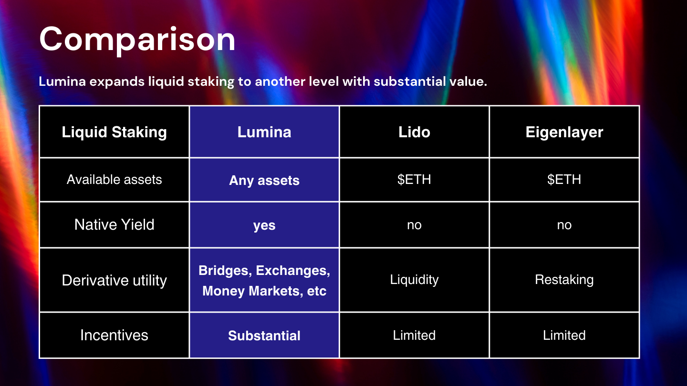

# ⚖ Comparison

## Liquid Staking

<figure><figcaption></figcaption></figure>

Unlike other liquid staking projects, Lumina utilizes liquid staking combined with bridge. This enables stakers to make their assets yield bearing. Also, it exposes cross-chain opportunity to benefit from providing liquidity to new chains or lend or borrow in new markets.&#x20;

## Bridge

