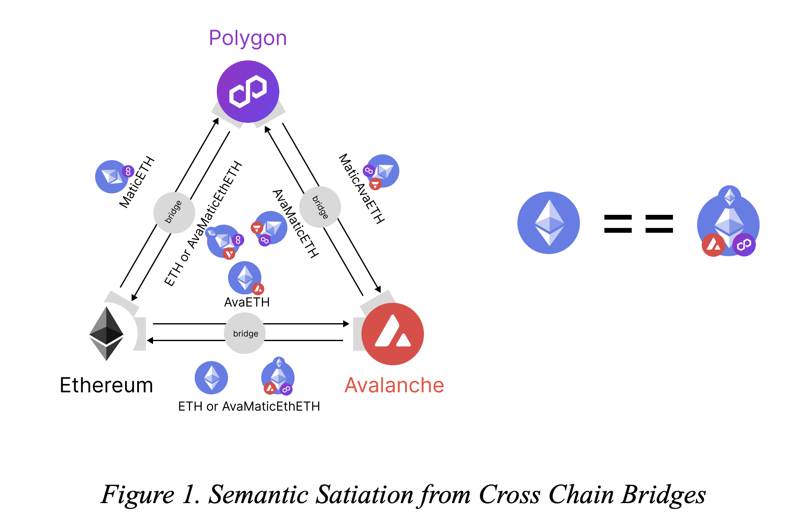

# Omnygram

## What is Omnygram?

<figure><figcaption></figcaption></figure>

Omnygram is the unified datagram standard to communicate between blockchain. It enables to execute transactions across blockchains from bottom-up approach.&#x20;

